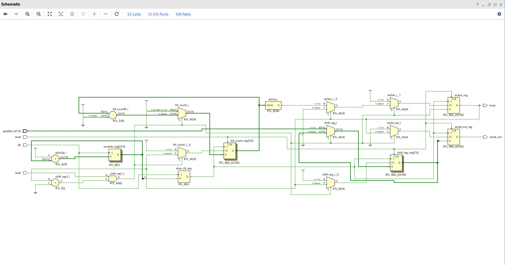
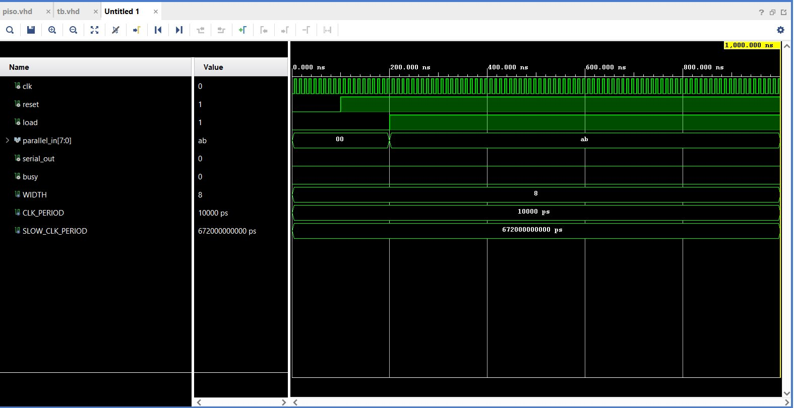
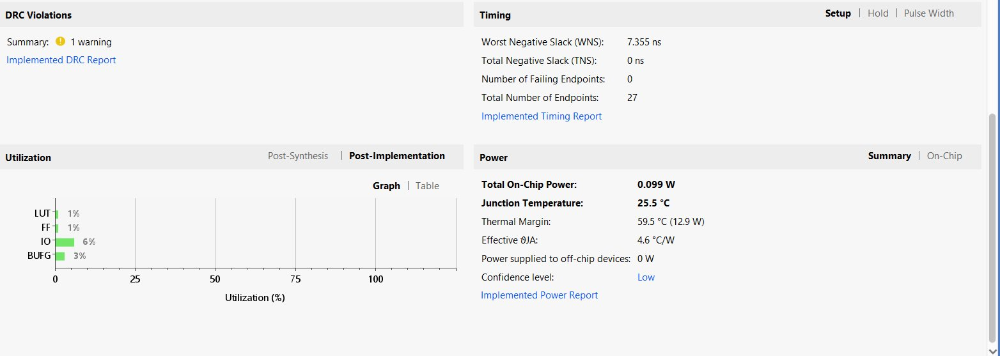

<h1 align="center">PISO Shift Register on FPGA</h1>

<p align="center">
  <strong>Design and Hardware Implementation of an 8-bit Parallel-In Serial-Out Shift Register on the Nexys 4 DDR FPGA</strong>
</p>

<p align="center">
  
  
  
  
  
</p>

---

## Table of Contents

- [Overview](#overview)
- [Key Features](#key-features)
- [Architecture](#architecture)
- [Project Structure](#project-structure)
- [Getting Started](#getting-started)
- [Pin Mapping](#pin-mapping)
- [Simulation Results](#simulation-results)
- [Implementation Results](#implementation-results)
- [Hardware Demo](#hardware-demo)
- [Tech Stack](#tech-stack)
- [References and Sources](#references-and-sources)
- [Authors](#authors)
- [License](#license)

---

## Overview

This project implements a fully functional **8-bit Parallel-In Serial-Out (PISO) shift register** on the **Digilent Nexys 4 DDR** FPGA development board. The design converts an 8-bit parallel data word (set via DIP switches) into a serial bit stream transmitted MSB-first at a human-visible rate of **~1.5 Hz**, allowing real-time observation of each bit on the board's LEDs.

The PISO shift register is a fundamental building block in serial communication protocols such as **SPI**, **I2C**, and **UART**, making this project a practical demonstration of core digital design principles.

---

## Key Features

| Feature | Description |
|---|---|
| **Configurable Width** | Generic `WIDTH` parameter (default 8-bit), easily extendable |
| **Clock Division** | 26-bit counter divides 100 MHz to ~1.49 Hz for visual observation |
| **Async Reset** | Active-low reset (`CPU_RESETN`) clears all internal state instantly |
| **Busy Indicator** | `busy` output stays HIGH during entire shift operation |
| **MSB-First Transmission** | Serial output follows industry-standard MSB-first bit ordering |
| **Minimal Resources** | Only **1% LUT**, **1% FF**, **0.099 W** power consumption |
| **Timing Clean** | WNS = +7.355 ns — zero timing violations at 100 MHz |

---

## Architecture

The design consists of two concurrent processes within a single VHDL entity:

```
                     +------------------------------------------+
                     |   parallel_to_serial_selector (RTL)      |
                     |                                          |
  clk (100 MHz) --->|  +----------------+                      |
                     |  |  Clock Divider  |   slow_clk           |
                     |  |  26-bit counter +----------+           |
                     |  +----------------+           |           |
                     |                               v           |
  parallel_in[7:0] ->|                    +------------------+  |
                     |                    |   PISO Process    |  |--> serial_out
  load ------------->|                    |  Load / Shift FSM |  |
                     |                    +------------------+  |--> busy
  reset (active-low) |                                          |
                     +------------------------------------------+
```

### Clock Divider

The 100 MHz system clock is divided using a 26-bit unsigned counter. Bit 25 of the counter serves as the slow clock:

```
f_slow = 100 MHz / 2^26 = 1.49 Hz    -->    T_slow = 671 ms per bit
```

A complete 8-bit transmission takes approximately **5.37 seconds**.

### PISO State Machine

| State | Condition | Action |
|---|---|---|
| **Reset** | `reset = '0'` | Clear shift register, bit counter, outputs |
| **Load** | `load = '1'` AND `active = '0'` | Latch `parallel_in` into `shift_reg`, set `bit_count = WIDTH` |
| **Shift** | `active = '1'` | Output MSB, left-shift register, decrement counter |
| **Done** | `bit_count = 1` | De-assert `active`, transmission complete |

### RTL Schematic

<p align="center">
  
</p>
<p align="center"><em>Vivado-generated RTL schematic — 53 cells, 13 I/O ports, 104 nets</em></p>

---

## Project Structure

```
piso_project/
├── README.md                       # This file
├── SOURCES.md                      # Detailed references and sources used
├── main.tex                        # Full LaTeX project report
│
├── code/
│   ├── piso.vhd                    # Synthesizable PISO shift register + clock divider
│   ├── tb.vhd                      # Behavioural simulation testbench
│   └── nexys4ddr_piso.xdc          # Vivado pin constraints for Nexys 4 DDR
│
└── images/
    ├── rtl_schematic.png           # Vivado RTL schematic
    ├── waveform.png                # Simulation waveform capture
    └── impl_summary.png           # Post-implementation summary
```

---

## Getting Started

### Prerequisites

- **Xilinx Vivado 2022.1** (or later) — [Download](https://www.xilinx.com/support/download.html)
- **Digilent Nexys 4 DDR** board (Artix-7 XC7A100T-1CSG324C)
- USB cable for JTAG programming

### Reproduce in Vivado

```
1.  Open Vivado -> Create New Project -> RTL Project
2.  Target Device: xc7a100tcsg324-1
3.  Add Design Source:     code/piso.vhd
4.  Add Constraints Source: code/nexys4ddr_piso.xdc
5.  Add Simulation Source: code/tb.vhd
6.  Set top module:        parallel_to_serial_selector
7.  Run Synthesis -> Implementation -> Generate Bitstream
8.  Open Hardware Manager -> Program Device
```

### Run Simulation

```
1.  In Vivado, set simulation top to: tb_parallel_to_serial
2.  Run Behavioural Simulation
3.  The testbench sends two patterns: 0xAB and 0xCC
```

---

## Pin Mapping

| Signal | Package Pin | IOSTANDARD | Physical Mapping |
|---|---|---|---|
| `clk` | E3 | LVCMOS33 | 100 MHz on-board oscillator |
| `reset` | C12 | LVCMOS33 | CPU_RESETN button (active-low) |
| `load` | N17 | LVCMOS33 | Centre push button |
| `parallel_in[0]` | J15 | LVCMOS33 | SW0 (LSB) |
| `parallel_in[1]` | L16 | LVCMOS33 | SW1 |
| `parallel_in[2]` | M13 | LVCMOS33 | SW2 |
| `parallel_in[3]` | R15 | LVCMOS33 | SW3 |
| `parallel_in[4]` | R17 | LVCMOS33 | SW4 |
| `parallel_in[5]` | T18 | LVCMOS33 | SW5 |
| `parallel_in[6]` | U18 | LVCMOS33 | SW6 |
| `parallel_in[7]` | R13 | LVCMOS33 | SW7 (MSB) |
| `serial_out` | H17 | LVCMOS33 | LED0 — serial bit output |
| `busy` | K15 | LVCMOS33 | LED1 — transmission active |

---

## Simulation Results

The testbench verifies two back-to-back transfers:

| Transfer | Pattern | Binary | Expected Serial Output (MSB-first) |
|---|---|---|---|
| 1st | `0xAB` | `10101011` | `1, 0, 1, 0, 1, 0, 1, 1` |
| 2nd | `0xCC` | `11001100` | `1, 1, 0, 0, 1, 1, 0, 0` |

<p align="center">
  
</p>
<p align="center"><em>Vivado behavioural simulation waveform — reset de-assertion, load trigger, and parallel_in setup</em></p>

---

## Implementation Results

<p align="center">
  
</p>

### Resource Utilization

| Resource | Used | Available | Utilization |
|---|---|---|---|
| LUT | — | 63,400 | **1%** |
| Flip-Flop | — | 126,800 | **1%** |
| I/O | 13 | 210 | **6%** |
| BUFG | 1 | 32 | **3%** |
| BRAM | 0 | 135 | 0% |
| DSP | 0 | 240 | 0% |

### Timing and Power

| Metric | Value |
|---|---|
| **Worst Negative Slack (WNS)** | +7.355 ns |
| **Total Negative Slack (TNS)** | 0 ns |
| **Failing Endpoints** | 0 / 27 |
| **Max Theoretical Frequency** | ~370 MHz |
| **On-Chip Power** | 0.099 W |
| **Junction Temperature** | 25.5 C |
| **Thermal Margin** | 59.5 C (12.9 W) |

---

## Hardware Demo

After programming the bitstream, the design was tested with five input patterns:

| # | SW[7:0] | Binary | LED0 (serial_out) Behaviour |
|---|---|---|---|
| 1 | `0xAB` | `10101011` | Toggled ON/OFF matching bit pattern; LED1 ON for ~5.4 s |
| 2 | `0xFF` | `11111111` | Stayed ON for all 8 cycles |
| 3 | `0x00` | `00000000` | Stayed OFF for all 8 cycles |
| 4 | `0xF0` | `11110000` | ON for 4 cycles, then OFF for 4 cycles |
| 5 | `0x01` | `00000001` | OFF for 7 cycles, ON for last cycle |

---

## Tech Stack

| Tool / Technology | Version / Standard | Purpose |
|---|---|---|
| **VHDL** | IEEE 1076-2008 | Hardware description language |
| **Xilinx Vivado** | 2022.1 | Synthesis, implementation, simulation, bitstream generation |
| **Vivado Simulator (xsim)** | Integrated | Behavioural simulation and waveform analysis |
| **Nexys 4 DDR** | Rev C | FPGA development board |
| **Artix-7 FPGA** | XC7A100T-1CSG324C | Target FPGA device |
| **LaTeX** | TeX Live / pdfLaTeX | Project documentation and report |

---

## References and Sources

> For a comprehensive list with descriptions, see [**SOURCES.md**](SOURCES.md).

1. Digilent Inc., *Nexys 4 DDR Reference Manual* — [Link](https://reference.digilentinc.com/nexys4-ddr)
2. Xilinx Inc., *7 Series FPGAs Data Sheet: Overview (DS180)* — [Link](https://www.xilinx.com/support/documentation/data_sheets/ds180_7Series_Overview.pdf)
3. Xilinx Inc., *Vivado Design Suite User Guide: Using Constraints (UG903)*, 2022
4. IEEE, *Standard VHDL Language Reference Manual — IEEE Std 1076-2008*
5. P. J. Ashenden, *The Designer's Guide to VHDL*, 3rd ed., Morgan Kaufmann, 2008
6. Pong P. Chu, *RTL Hardware Design Using VHDL*, Wiley-IEEE Press, 2006
7. M. M. Mano and M. D. Ciletti, *Digital Design: With an Introduction to Verilog HDL*, 5th ed., Pearson, 2013

---

## Authors

| Name | Role |
|---|---|
| **Molik Rajvanshi** | Design, Implementation, Verification |
| **Ujjawal Khatri** | Design, Implementation, Verification |

---

## License

This project is open for educational and personal use. Feel free to reference or build upon it.
